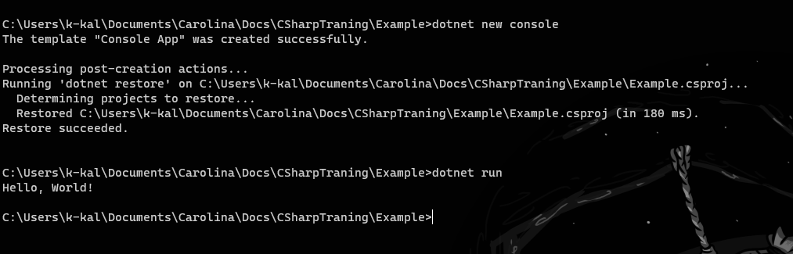
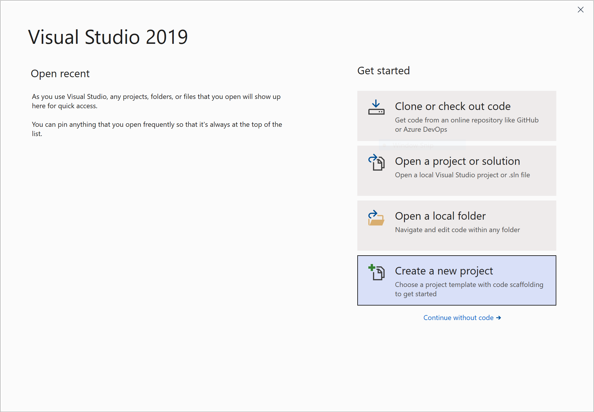
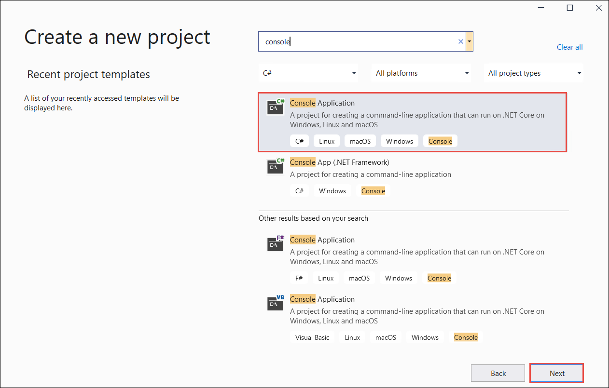
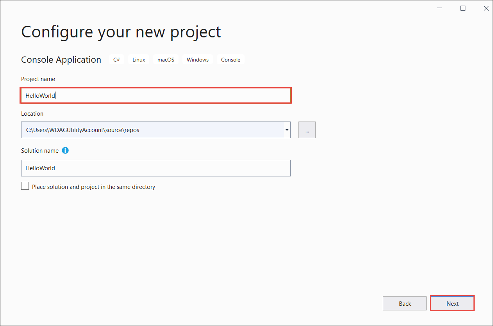
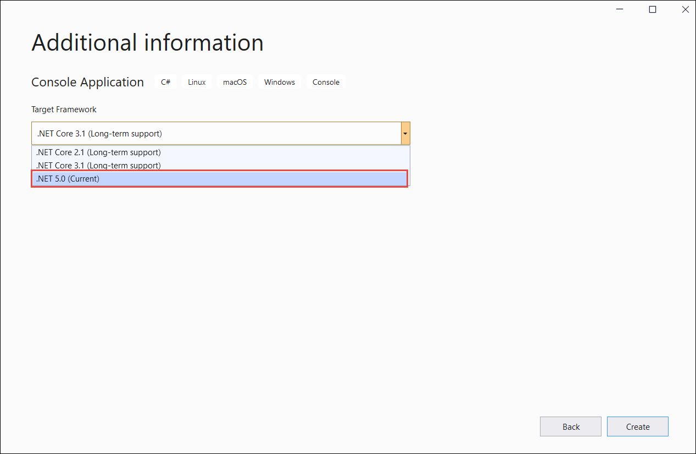

# С чего начать?

## Установка ПО

Для начала вам нужно установить [Net SDK](https://dotnet.microsoft.com/download/dotnet)

Затем откройте окно терминала, например **PowerShell**, командную строку или bash. Для создания и запуска приложения C# введите следующие команды `dotnet`:

<pre>
    > dotnet new console
    > dotnet run
</pre>

Вы увидите такой результат:

Установите [Visual Studio](https://visualstudio.microsoft.com/ru/downloads/) с установленным расширением *Кроссплатформенная разработка .NET Core*. Пакет SDK для .NET 5.0+ устанавливается автоматически при выборе этого расширения.

1. Запустите Visual Studio 2019.
2. На начальной странице выберите Создать проект.

3. На странице Создание проекта введите в поле поиска консоль. Затем выберите C# или Visual Basic из списка языков, а затем — **Все платформы** из списка платформ. Выберите шаблон Консольное приложение и нажмите **Далее**.

4. В диалоговом окне **Настройка** нового проекта в поле Имя проекта введите HelloWorld. Нажмите кнопку **Далее**.

5. В диалоговом окне Дополнительные сведения выберите **.NET 5.0 (текущая)** , а затем нажмите **Создать**.

Этот шаблон создает простое приложение Hello World. Он вызывает метод **Console.WriteLine(String)** для отображения сообщения `"Hello World!"` в окне консоли.

Поздравляем! Вы создали простое приложение .NET.
